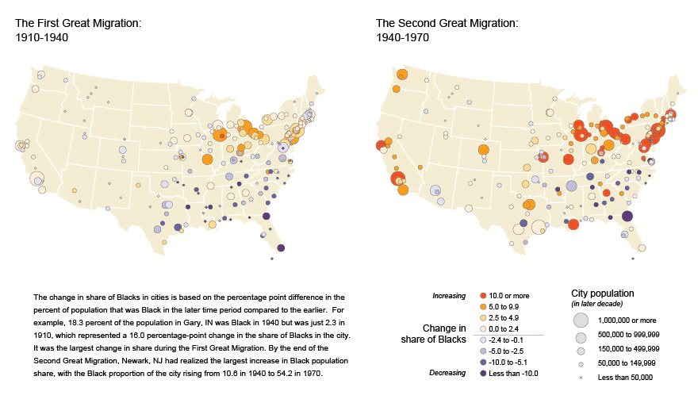
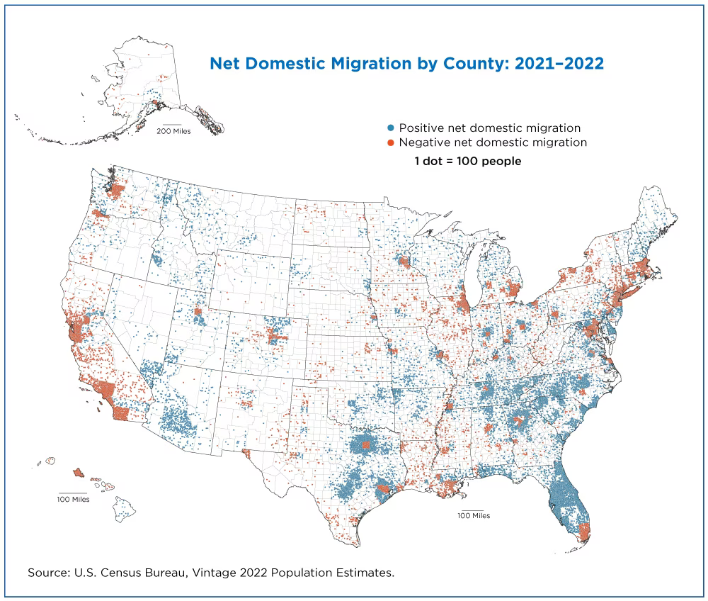

# Migracje w Stanach Zjednoczonych 

## Dlaczego ten temat jest istotny?
Wzory migracji w USA w czasach po II wojnie światowej były dość oczywiste. Kraj ten był krajem wiejskim (sczególnie przed czasami Wielkiej Depresji). Industrializacja, utrata rodzinnych farm, pobór czasów II wojny światowej, rozwór gospodarki rynkowej przyczyniła się do zmiany, gdzie ludzie zaczęli przenosić się z obszarów wiejskich do miast.

Poniższa mapa przedstawia migrację osób czarnych z południa na północ. Na podstawie tej mapki, widać wyraźnie koncentracje populacji w wielkich miastach takich jak Los Angeles, San Francisco, Chicago, Nowy Jork.

Miasto było miejscem pracy, aktywności oraz wypoczynku. Amerykanie kierowali się do miast lub do przedmieści. Ten trend na przestrzeni lat był stały i praktycznie nigdy nie uległ odwróceniu, co było spowodowane niskimi (czasami praktycznie zerowymi) stopami procentowymi oraz rozdawnictwem kredytowym aż do roku 2008.

## Pandemia
Pandemia COVID odwróciła trendy panujące przez ponad 100 lat. W roku 2019, mniejsze hrabstwa mające mniej niż 30k ludzi traciły populację. Jednak w szczycie pandemii pomiędzy rokiem 2020 i 2021 sytuacja się odwróciła. Najmniej ludne hrabstwa zaczęły zdobywać populacje. Hrabstwa z populacją większą od 1.000.000 przed pandemią traciły ludność bardzo powoli, a po pandemii sytuacja osiągnęła ekstremum. 

.png)

Jak jasno widać na mapie, ludzie uciekają z miejsc takich jak LA, SF, NY, Seattle, na korzyść bardziej wiejskich terenów dookoła miast. Zdecydowanie najlepiej widać to na południu. Jest to spowodowane głownie brakiem przystępności cenowej dużych miast. (Miami na florydzie jako jedyne jest czerwone tak samo jak Dallas, Huston TX.)

USA staje się coraz mniej skoncentrowane w dużych miastach. Przyczynił się do tego rozwój szerokopasmowego internetu, przez co ludzie pracujący zdalnie, bez problemu mogą mieszkać w bardziej *affordable* miejscach.

Miejsca, które od czasów wielkiej depresji nie były zamieszkiwane zaczynają na nowo napełniać się ludźmi.

Jakie będzie to miało znaczenie w przyszłości? Niektóre stany historycznie 'czerwone' takie jak Georgia czy Texas zaczynają wchodzić w kategorię 'fioletowe'. Przypływ ludzi zmienia sposób działania partii politycznych, tego jak działa cała ekonomia. 

## Cel projektu
Celem naszego projektu jest znalezienie zależności pomiędzy emigracją/imigracją a czynnikami takimi jak edukacja, ceny nieruchomości, stan zdrowia mieszkańców, zamożność hrabstw i ich mieszkańców czy struktury zatrudnienia. Dane pochodzą z rzetelnych źródeł takich jak agencje i organizacje rządowe.

